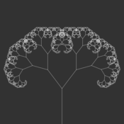
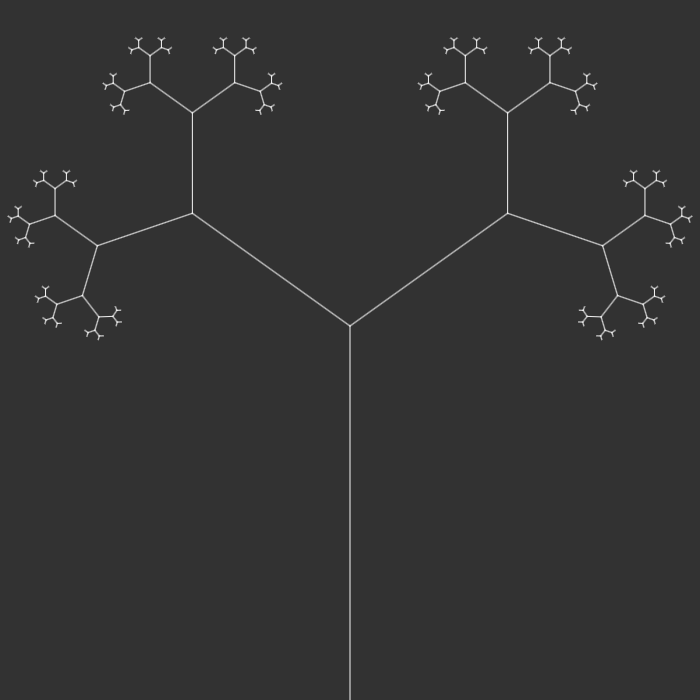
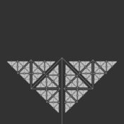
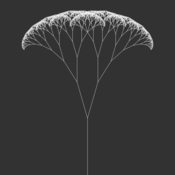

# Simple fractal tree with p5.js

This project is a simple fractal tree that can be modified with four sliders that represents initial branch lenght, minimum lenght of branches, the ratio to divide the branches lenght and the rotation angle of each sub-branch.

You can try it from this link: [Simple Fractal Tree](https://editor.p5js.org/hectorxlxs/full/Xn3UNwiVV)

Modifying the different parameters you can create multiple type of trees.
Here are some examples:

